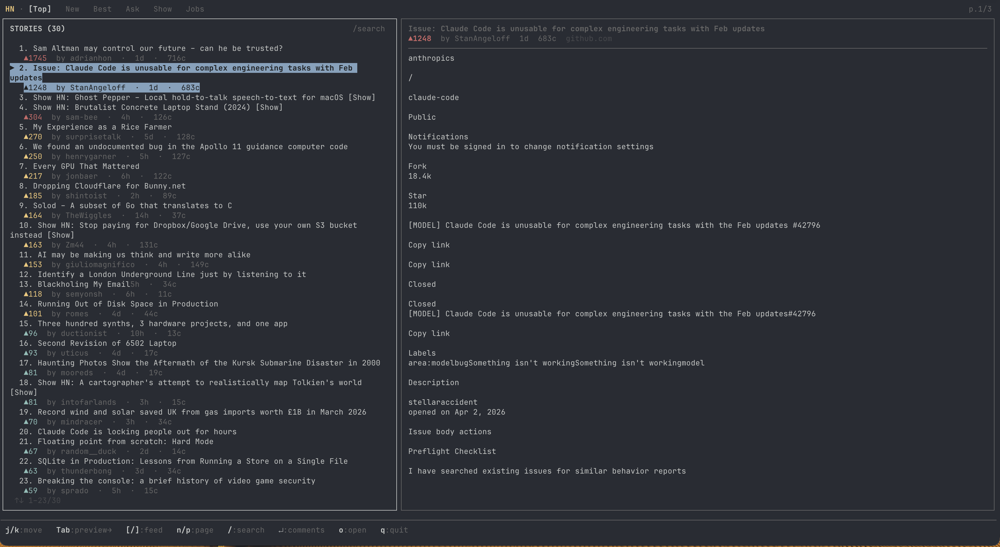

# hacker-news

Terminal Hacker News reader built with Bun + TypeScript + Ink.

Two-pane layout with story list, article preview, and full-screen comment threads.



## Install

```sh
bun add -g @onmyway133/hacker-news
```

## Usage

```sh
bunx @onmyway133/hacker-news           # Open front page
bunx @onmyway133/hacker-news new       # New stories
bunx @onmyway133/hacker-news ask       # Ask HN
bunx @onmyway133/hacker-news show      # Show HN
bunx @onmyway133/hacker-news jobs      # Jobs
bunx @onmyway133/hacker-news best      # Best stories
```

Or if installed globally:

```sh
hacker-news
hacker-news new
```

## Keyboard Shortcuts

### Browse mode

| Key | Action |
|-----|--------|
| `j` / `↓` | Move down |
| `k` / `↑` | Move up |
| `Tab` | Switch panes (stories ↔ preview) |
| `[` / `]` | Previous / next feed |
| `1`–`6` | Jump to feed (Top/New/Best/Ask/Show/Jobs) |
| `n` / `p` | Next / prev page |
| `/` | Search |
| `Enter` | Open comment thread |
| `o` | Open article in browser |
| `O` | Open HN discussion page in browser |
| `r` | Refresh |
| `q` | Quit |

### Comments mode

| Key | Action |
|-----|--------|
| `j` / `k` | Move through comments |
| `Space` | Collapse / expand thread |
| `o` | Open article in browser |
| `O` | Open HN discussion page in browser |
| `Esc` | Back to stories |
| `q` | Quit |

## Features

- Six feeds: Top, New, Best, Ask HN, Show HN, Jobs
- Two-pane layout with live article preview
- Full-screen threaded comment reader with collapse/expand
- Algolia-powered search
- Score-based color coding (red=hot, yellow=warm, cyan=notable)
- Read state tracking (dimmed stories)
- SQLite cache (`~/.hackernews/cache.db`) — 5 min TTL for feeds, 24h for articles
- Mouse/trackpad scroll support
- Responsive layout (collapses preview pane on narrow terminals)

## Requirements

- [Bun](https://bun.sh) 1.0+

## Local Development

```sh
git clone <repo>
cd hacker-news-cli
bun install
bun run dev
```

```sh
bun run build      # Build to dist/
./bin/hacker-news  # Run built binary
```
